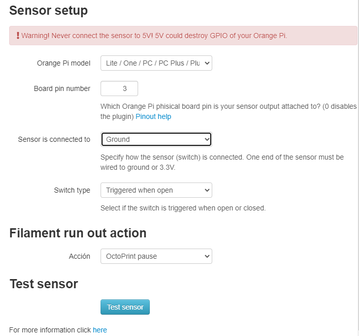

# Filament sensor simplified Orange Pi

This plugin reacts to short lever microswitch output like [this](https://chinadaier.en.made-in-china.com/product/ABVJkvyMAqcT/China-1A-125VAC-on-off-Kw10-Mini-Micro-Mouse-Switch.html)
If triggered it issues configured command to printer.

Let's check some features:
* pop-up notification when printer runs out of filament
* very handy pop-up when printer requires user input while changing filament
* test button so you know if your sensor really works or not
* filament check at the start of the print - if no filament present it won't start printing, again pop-up will appear
* filament check at the end of filament change - just to be sure you won't start printing with no filament
* check if printer supports M600 when printer connected and gcode starts with M600 - if not user will be notified through pop-up
* info pop-up when plugin hasn't been configured
* filament runouts can be repeatable which didn't work with other plugins I tried
* user-friendly and easy to configure
* pin validation so you don't accidentally save wrong pin number
* detection of used GPIO mode - this makes it compatible with other plugins
* handles delibrate M600 filament change
* runs on OctoPrint 1.3.0 and higher

**NOTE: this plugin won't work if you use OctoPrint only to start printing from SD card**

## Requires

* python 3 o higher
* [OPi.GPIO v0.5.2](https://github.com/rm-hull/OPi.GPIO)

## Setup

Install manually using this URL:

    https://github.com/camochu/Filament_sensor_simplified_OPi/archive/master.zip

More info to [install Octoprint plugins](https://plugins.octoprint.org/help/installation/)

## Configuration

Configuration consists of these parameters:
1. **Orange Pi model** - to select Orange Pi model, grouped by similar GPIO connector BOARD
2. **Board pin number** - pin number based on selected model. Always use the physical pin number in board
3. **Sensor is connected to** - select if sensor is connected to **ground or 3.3 V**
4. **switch type** - switch should be **triggered when opened** (input of the sensor doesn't transfer to its output) or **triggered
when closed** (input of the sensor is transferred to its output)
5. **Action** - select if you want to send pause to Octoprint or send your own G-code to printer on filament runout. When G-code is selected, you can write g-code in a textbox - default is M600 X0 Y0

Default pin is 0 (not configured) and ground (as it is safer, read below).

**WARNING! When using test button on input pin used by other application it will reset internal pull up/down resistor**

**WARNING! As internal pull up/down resistor is not implemented in last version of OPi.GPIO, you MUST USE EXTERNAL PULL UP/DOWN RESISTORS (or been sure that selected pin has permanent internal pull up/down)**

**WARNING! Never connect the switch input or pull up resistors to 5V as it could fry the GPIO section of your Orange Pi!**

#### Advice

You might experience the same problem as I experienced - the sensor was randomly triggered. Turns out that if running sensor wires along motor wires, it was enough to interfere with sensor reading.

To solve this connect a shielded wire to your sensor and ground the shielding, ideally on both ends.

If you are unsure about your sensor being triggered, check [OctoPrint logs](https://community.octoprint.org/t/where-can-i-find-octoprints-and-octopis-log-files/299)

## Support author

This plugin was forked to support my own device and configuraton and developed in my spare time.
If you find it useful and like it, you can support Lukáš Malatinský as original author by clicking the button below :)

## Screenshots

Plugin settings:

No configuration pop-up:

Pop-up for M600 disabled:

No filament when starting print pop-up:

Filament runout pop-up:

Waiting for user input pop-up:

